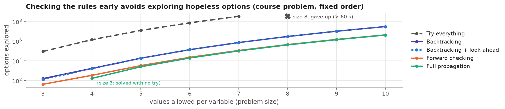
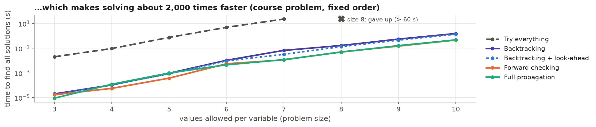
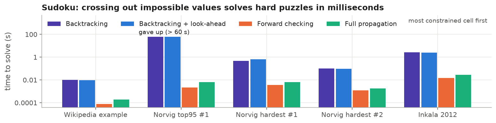
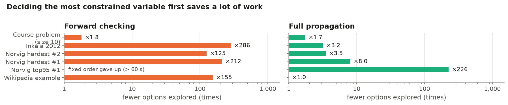

# Solving problems made of rules: a constraint solver in Java

## The problem

Many problems come down to choosing a value for each unknown so that a set of rules holds ("x must be smaller than
y", "these two cells must differ"...). This is a **constraint satisfaction problem**. Trying every combination is
hopeless: 10 unknowns with 10 possible values each give 10 billion combinations. This project is a small solver,
written from scratch in Java, that compares five ways of searching, from naive to smart:

- **Try everything**: list every combination and keep those that follow the rules.
- **Backtracking**: fill in the unknowns one by one and back up as soon as a rule is broken.
- **Backtracking + look-ahead**: also back up as soon as a rule can no longer be satisfied.
- **Forward checking**: after each choice, cross out the values it makes impossible elsewhere.
- **Full propagation**: keep crossing out until nothing more can be crossed out.

It can also fill in the unknowns in a fixed order, or the most constrained one (fewest values left) first.

## Why it is useful

The same technique builds school and exam timetables, staff rosters and production schedules, configures products,
plans deliveries, checks hardware and software designs, and solves puzzles such as Sudoku.

## What we learned

We tested it on the course's two benchmark problems, whose number of solutions is known (every run that finished found
exactly the published count, up to 2 million solutions), and on five famous Sudokus, including the "world's hardest".

| Strategy (most constrained first; limit 60 s) | Course problem, size 10 | Hardest Sudoku (Inkala) | Sudoku "top95 #1" |
| :--- | :-: | :-: | :-: |
| Try everything | gave up (already at size 8) | — | — |
| Backtracking | 1.6 s | 2.6 s | gave up |
| Backtracking + look-ahead | 1.3 s | 2.5 s | gave up |
| **Forward checking** | **0.18 s** | **0.014 s** | **0.002 s** |
| **Full propagation** | 0.19 s | 0.027 s | 0.007 s |

**1. Checking the rules early avoids hopeless options.** At size 7 (fixed order), trying everything examines 330
million options; forward checking needs 110,000, about 3,000 times fewer. From size 8, trying everything no longer finishes.

**2. That makes solving about 2,000 times faster:** 23 seconds against 0.011 seconds at size 7.

**3. On Sudoku, crossing out impossible values is what matters.** Filling the most constrained cell first, backtracking
gave up on one hard puzzle and needed up to 3 seconds on the others; forward checking and full propagation solved every
puzzle, and proved its solution is the only one, in under 0.03 seconds.

**4. Filling in the most constrained unknown first saves a lot of work:** up to 286 times fewer options on Sudoku, 1.8
times fewer on the course problem. Detailed results for every run are in [`results/`](results).

